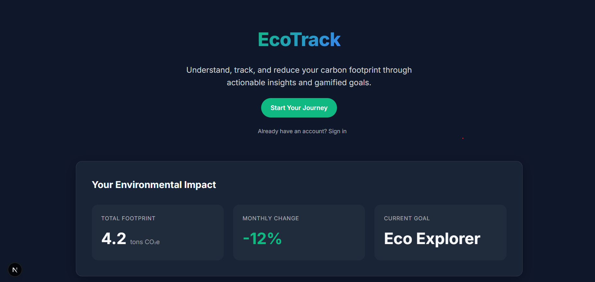
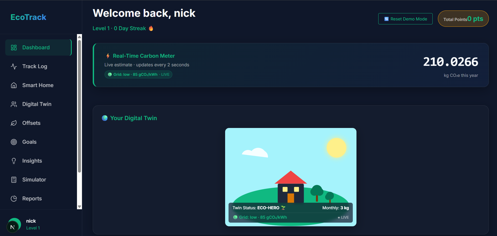
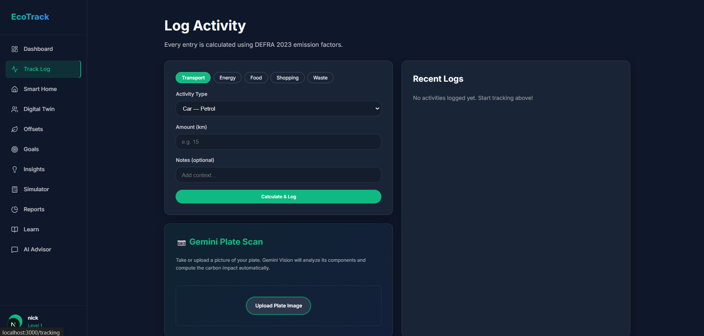
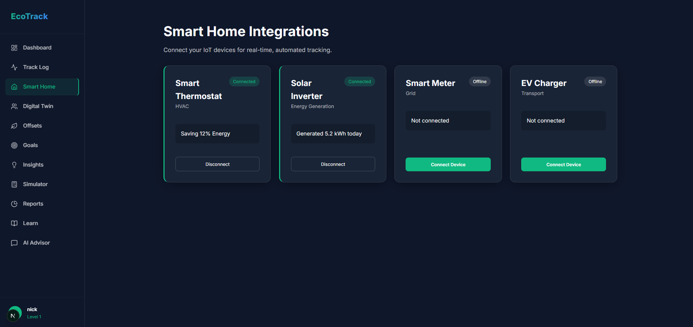

# 🌍 EcoTrack — Personal Climate Operating System


> AI-powered carbon footprint tracking, climate intelligence, and sustainability coaching.

## 📸 Application Preview

### Home Page


### Dashboard & Digital Twin


### Gemini Vision Plate Scan


### Smart Home Simulator



---


---

## 🚀 Overview

EcoTrack is an AI-powered sustainability platform that helps individuals understand, track, and reduce their carbon footprint through intelligent automation, real-time environmental insights, and personalized climate coaching.

Unlike traditional carbon calculators that rely heavily on manual data entry, EcoTrack combines:

* 🤖 AI-powered climate coaching
* 📷 Computer Vision meal analysis
* 🌱 Interactive Digital Twin visualization
* ⚡ Live grid-intensity awareness
* 🎯 Goal-based carbon reduction planning
* 📊 Advanced analytics and reporting

The result is a modern Personal Climate Operating System that makes sustainability measurable, actionable, and engaging.

---

## ✨ Key Features

### 🌍 Interactive Digital Twin

A dynamic visual representation of the user's environmental impact.

The Digital Twin reacts to:

* Monthly emissions
* Clean energy adoption
* Goal completion
* Carbon reduction progress
* Grid intensity changes

Visual changes include:

* Healthy green ecosystem
* Solar panel activation
* Wind turbine generation
* Tree growth and decline
* Atmospheric pollution indicators

---

### 📷 Gemini Vision Plate Scan

Track food emissions with a single photo.

Upload an image of a meal and EcoTrack:

1. Detects food items using Gemini Vision
2. Estimates ingredient weights
3. Maps foods to emission factors
4. Calculates carbon impact
5. Logs results automatically

This significantly reduces manual food tracking friction.

---

### 🤖 AI Climate Agent

EcoTrack includes a tool-calling AI assistant capable of performing actions directly within the platform.

Examples:

* Create sustainability goals
* Log activities
* Analyze behavior patterns
* Recommend carbon reductions
* Provide personalized climate guidance

Example:

> "Create a goal to reduce my transport footprint by 20% this month."

The AI converts natural language into actual database actions.

---

### ⚡ Live Grid Intelligence

EcoTrack incorporates regional electricity carbon intensity data to improve emission calculations.

Benefits:

* More realistic electricity footprint calculations
* Region-aware sustainability insights
* Dynamic climate recommendations

---

### 🎯 Goal Management

Users can create:

* Reduction goals
* Carbon limits
* Sustainability streaks
* Habit-building challenges

Progress is automatically updated as activities are logged.

---

### 📊 Analytics & Reporting

Comprehensive insights including:

* Monthly emissions
* Category breakdowns
* Historical trends
* Goal performance
* Sustainability score tracking

---

### 🔄 Demo Mode

One-click demo seeding for presentations and evaluations.

Features:

* Sample user profile
* Historical activity data
* Pre-completed goals
* Realistic dashboard metrics

Perfect for hackathons and product demonstrations.

---

## 🏗️ System Architecture

```text
                ┌─────────────────┐
                │    Frontend     │
                │  Next.js 16     │
                └────────┬────────┘
                         │
                         ▼
                ┌─────────────────┐
                │ Zustand Store   │
                │ State Manager   │
                └────────┬────────┘
                         │
                         ▼
                ┌─────────────────┐
                │ API Routes      │
                │ App Router      │
                └────────┬────────┘
                         │
         ┌───────────────┼───────────────┐
         ▼               ▼               ▼
 ┌─────────────┐ ┌─────────────┐ ┌─────────────┐
 │ Gemini AI   │ │ MongoDB     │ │ Grid Data   │
 │ Vision      │ │ Database    │ │ Services    │
 └─────────────┘ └─────────────┘ └─────────────┘
```

---

## 🛠️ Technology Stack

### Frontend

* Next.js 16
* React 19
* Tailwind CSS
* Zustand
* Chart.js

### Backend

* Next.js API Routes
* MongoDB
* Mongoose

### AI

* Google Gemini
* Gemini Vision
* Function Calling / Tool Use

### Authentication

* NextAuth

### Testing

* Jest
* React Testing Library

---

## 📈 Performance & Quality

### Testing

* 97/97 tests passing
* 98%+ statement coverage
* 87%+ branch coverage
* Integration testing
* Component testing

### Security

* Authentication-protected APIs
* Input validation
* XSS protection
* Rate limiting
* Secure password hashing

### Accessibility

* WCAG-compliant contrast
* Keyboard navigation support
* ARIA labels
* Accessible SVG descriptions

---

## 🚀 Installation

### Clone Repository

```bash
git clone https://github.com/yourusername/ecotrack.git
cd ecotrack
```

### Install Dependencies

```bash
npm install
```

### Configure Environment Variables

Create a `.env.local` file:

```env
MONGODB_URI=your_mongodb_connection
NEXTAUTH_SECRET=your_secret
GEMINI_API_KEY=your_gemini_api_key
```

### Start Development Server

```bash
npm run dev
```

Visit:

```text
http://localhost:3000
```

---

## 🧪 Running Tests

```bash
npm test
```

Generate coverage report:

```bash
npm test -- --coverage
```

---

## 📂 Project Structure

```text
src/
├── app/
│   ├── dashboard/
│   ├── tracking/
│   ├── coach/
│   ├── goals/
│   ├── reports/
│   └── api/
├── components/
│   ├── DigitalTwin.js
│   ├── Navigation.js
│   └── ...
├── models/
│   ├── User.js
│   ├── Goal.js
│   └── ActivityLog.js
├── lib/
│   ├── calculator.js
│   ├── emissionFactors.js
│   ├── gridFactors.js
│   └── db.js
├── store/
│   └── useStore.js
└── __tests__/
```

---

## 🎥 Demo Flow

1. Reset Demo Mode
2. Open Dashboard
3. Showcase Digital Twin
4. Upload meal image using Plate Scan
5. Log carbon impact
6. Watch Digital Twin react
7. Create goal using AI Agent
8. View updated dashboard metrics

---

## 🌱 Future Roadmap

* Smart meter integrations
* Home Assistant connectivity
* Real-time IoT telemetry
* Carbon offset marketplace
* Mobile application
* Advanced AI forecasting
* Community sustainability challenges

---

## 👨‍💻 Team

Built as a climate-tech platform focused on making carbon awareness actionable through AI, automation, and intuitive user experiences.

---

### “You can’t improve what you can’t measure. EcoTrack makes climate impact visible, understandable, and actionable.”
